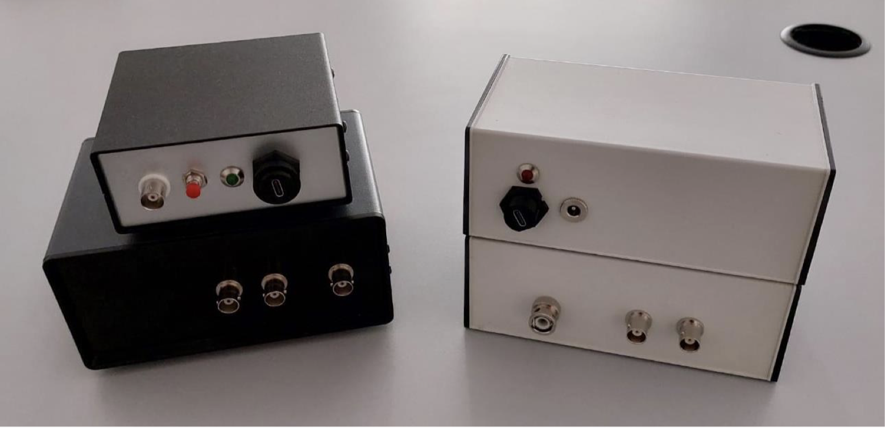

# Silicon Spike: An Arduino Trigger Box for TMS

> 🔗 GitHub Repository: [Ippolz/SiliconSpike](https://github.com/Ippolz/SiliconSpike)  
> 📄 Published Paper: [pdf](assets/pdf/paper7.pdf)

---

## Description

**Silicon Spike** is an open-source **Arduino-based trigger box** developed at the **Center for Cognitive Neuroscience of Cesena** (University of Bologna). It offers a cost-effective and customizable way to control **Transcranial Magnetic Stimulation (TMS)** and **Biopac** systems with high precision.

The system was designed by **Giuseppe Ippolito** and **Thomas Quettier** with the goal of empowering neuroscience labs with affordable hardware that integrates seamlessly into experimental pipelines.

---

## Features

- ⚙️ **TMS & Biopac Integration**  
  Compatible with commercial TMS devices and physiological recording systems.

- 🔁 **Custom Triggering Sequences**  
  Easily adaptable via Arduino code for specific experimental needs.

- 💻 **Open Source**  
  Full access to firmware and hardware documentation.

- 📖 **Clear Setup Instructions**  
  Step-by-step guide available in the repository README.

---

## How to Cite

If you use Silicon Spike in your research, please cite our paper:

> **Ippolito, G., Quettier, T., Borgomaneri, S., & Romei, V.** (2025).  
> _Silicon Spike: An Arduino-based low-cost and open-access triggerbox to precisely control TMS devices_.  
> _Behavior Research Methods_, 57(5), 145.  
> [https://doi.org/10.3758/s13428-025-02653-y](https://doi.org/10.3758/s13428-025-02653-y)

---

## License

This project is licensed under the **[MIT License]** _(please update this to the actual license used)_.  
See the [`LICENSE.md`](https://github.com/Ippolz/SiliconSpike/blob/main/LICENSE.md) file for full details.

---

## Contributions

We welcome improvements and suggestions from the community!

To contribute:

- Fork the repository
- Make your improvements
- Submit a pull request

Please also review the [`CONTRIBUTING.md`](https://github.com/Ippolz/SiliconSpike/blob/main/CONTRIBUTING.md) guidelines before submitting.

---

## Contact

For questions or collaboration:

- **Thomas Quettier** — [thomas.quettier2@unibo.it](mailto:thomas.quettier2@unibo.it)
- **Giuseppe Ippolito** — [giuseppe.ippolito8@unibo.it](mailto:giuseppe.ippolito8@unibo.it)

---

## Acknowledgements

Special thanks to the **Center for Cognitive Neuroscience, University of Bologna** for their support throughout the development of this project.
